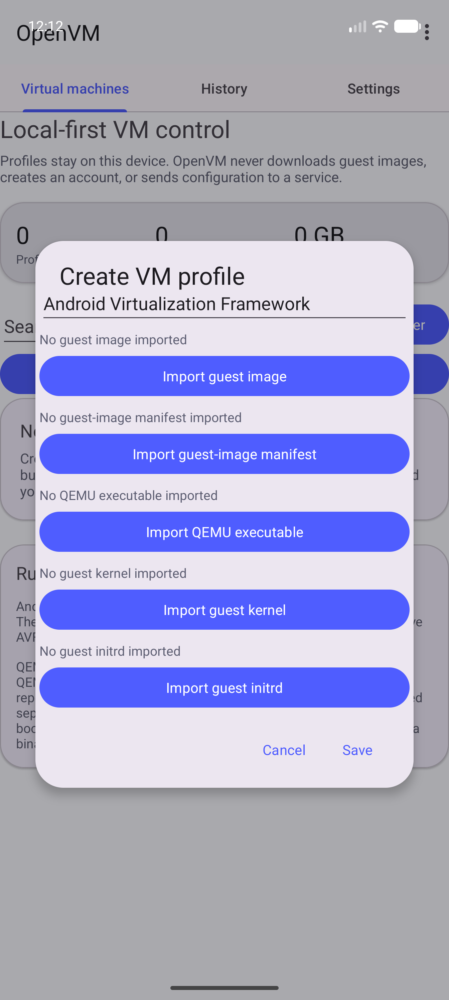

# Guest-image manifest

## Behavior

QEMU profiles require a user-selected guest-image manifest before OpenVM starts a
process. The manifest is a small UTF-8 JSON sidecar that binds the selected disk
image to its expected architecture, QEMU machine, raw-disk format, byte count,
SHA-256 digest, and boot contract. OpenVM copies the sidecar into app-private
storage, parses it with unknown fields and duplicate root keys rejected, and checks
it against the saved profile.

The current schema is version `1`:

```json
{
  "schemaVersion": 1,
  "architecture": "arm64-v8a",
  "machine": "virt",
  "diskFormat": "raw",
  "sizeBytes": 4294967296,
  "sha256": "0123456789abcdef0123456789abcdef0123456789abcdef0123456789abcdef",
  "bootContract": "kernel-initrd",
  "kernelPath": "boot/Image",
  "initrdPath": "boot/initrd",
  "kernelCommandLine": "console=ttyAMA0",
  "kernelSizeBytes": 8388608,
  "kernelSha256": "0123456789abcdef0123456789abcdef0123456789abcdef0123456789abcdef",
  "initrdSizeBytes": 16777216,
  "initrdSha256": "0123456789abcdef0123456789abcdef0123456789abcdef0123456789abcdef"
}
```

Supported architecture/machine pairs are `arm64-v8a`/`virt` and `x86_64`/`q35`.
The only accepted disk format is `raw`. The disk size must be positive and no more
than 4 TiB; the digest must be exactly 64 lowercase hexadecimal characters. A
`disk-only` manifest contains no kernel or initrd fields. A `kernel-initrd` manifest
requires safe relative paths and complete size/SHA-256 metadata for both artifacts,
and may include a bounded kernel command line. The paths are guest-side labels; they
are never used as host filesystem paths.

The profile editor can import the manifest and, for the `kernel-initrd` contract,
the selected kernel and initrd. OpenVM hashes those materialized files and compares
their size and digest with the manifest before QEMU receives them. The command
builder passes the files through `-kernel`, `-initrd`, and an optional `-append`
argument without a shell.

## Configuration and persistence

Manifest and boot-artifact references are persisted as Storage Access Framework
content URIs in the local profile JSON. The bytes are never uploaded. At start,
OpenVM materializes the manifest, image, executable, and optional boot artifacts in
separate app-private directories and replaces each destination atomically.

## Failure modes

- Missing or unreadable JSON is reported before a process starts.
- Unknown fields, duplicate root keys, invalid JSON, unsupported schema values,
  architecture/machine pairs, formats, or boot contracts are rejected.
- Malformed UTF-8, deeply nested JSON, and incomplete kernel/initrd integrity
  metadata are rejected.
- Absolute, URI-like, backslash-containing, empty-component, traversal, duplicate-
  component, or control-character boot paths are rejected.
- A disk whose actual byte count or SHA-256 differs from the manifest is rejected.
- A kernel-initrd manifest without both selected artifacts, or with a kernel/initrd
  size or SHA-256 mismatch, is rejected.

The profile remains stopped or enters an explicit error state; OpenVM never reports
that a guest booted because a sidecar parsed successfully.

## Security considerations

The manifest is integrity metadata, not a trust boundary. Guest images, kernels,
initrds, and QEMU are executable inputs and still run with the permissions of the
OpenVM process. JSON is bounded to 64 KiB with strict UTF-8 and nesting limits, boot
paths are never treated as host paths, and every runtime file is validated as a
regular readable file under the app-private runtime directory before process launch.

## Verification

- `GuestImageManifestTest` covers valid disk-only and kernel-initrd contracts,
  required fields, schema and capability rejection, path safety, size and digest
  bounds, duplicate/unknown fields, strict UTF-8 and nesting bounds, profile
  compatibility, and materialized image/kernel/initrd integrity matching.
- `QemuRuntimeControllerTest` covers explicit kernel/initrd command construction.
- `RfbClientTest` covers bounded key and pointer packet construction for the private
  display channel.
- The Android emulator smoke suite continues to verify the profile editor's QEMU
  asset controls; a real Android guest boot remains a separate hardware/runtime
  verification gate.

The manifest controls are visible in the API 37 emulator capture:



## Suggested articles

- [QEMU runtime adapter](qemu-runtime.md)
- [VM profiles](vm-profiles.md)
- [Search and regex builder](search-and-regex.md)
