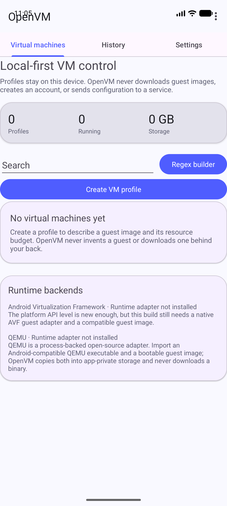

# QEMU runtime adapter

OpenVM now contains a process-backed QEMU adapter for profiles whose backend is
`qemu`. The adapter proves the guest process lifecycle and serial output boundary
and can expose a framebuffer-only display over a private UNIX-domain VNC socket.
It still requires a user-supplied runtime and bootable image; a running process is
not treated as proof that Android has booted.

## Configuration

1. Create or edit a VM profile.
2. Select **QEMU** as the runtime backend.
3. Import an Android-compatible QEMU executable. It must be an ELF executable
   for the device's host ABI; OpenVM does not download or bundle an opaque binary.
4. Import a version-1 [guest-image manifest](guest-image-manifest.md).
5. Import a bootable raw guest disk image whose size and SHA-256 match the manifest.
6. If the manifest uses `kernel-initrd`, import the kernel and initrd files whose
   size and SHA-256 match the manifest metadata.
7. Select **Start**.

OpenVM copies the selected executable, image, and optional boot artifacts from their
Storage Access Framework URIs into `files/runtime-assets/`. Each copy is bounded,
SHA-256 hashed, written to a unique temporary sibling, and atomically committed. The
QEMU controller accepts only regular files inside that app-private directory.

## Command contract

The controller invokes QEMU through `ProcessBuilder`, never through a shell. It uses
the profile's memory and vCPU limits and selects a portable TCG machine:

- `x86_64`: `q35,accel=tcg`
- `arm64-v8a`: `virt,accel=tcg`

The guest image is attached as a raw virtio disk. A `kernel-initrd` contract adds
the selected kernel, initrd, and bounded command line explicitly. The command uses `-display none`,
`-serial stdio`, `-monitor none`, and `-no-reboot`; when the profile is running it
also adds `-vnc unix:<app-private-socket>`. The Android client accepts only RFB 3.8
with the unauthenticated raw encoding, bounds framebuffer dimensions and rectangle
counts, and never opens a TCP listener. It renders framebuffer updates and sends
bounded touch/key events over the same local channel; clipboard, serial console,
file transfer, and guest boot readiness remain separate work. The
option meanings follow [QEMU's system-emulation documentation](https://www.qemu.org/docs/master/system/qemu-manpage.html)
and [QEMU's VNC security guidance](https://www.qemu.org/docs/master/system/vnc-security.html).

## Lifecycle and failure behavior

The controller exposes `STARTING`, `RUNNING`, `STOPPING`, `STOPPED`, and `ERROR`.
`RUNNING` is emitted only after a process exists and is still alive. Natural exit,
non-zero exit, missing assets, malformed ELF input, an unexecutable file, an
external path, and invalid profile resources all produce explicit error or stopped
states. Output is retained only as a bounded tail for diagnostics.

Stopping first sends a normal process destroy request and waits for a bounded period;
it then forcefully destroys the process and verifies exit before recording `STOPPED`.
A lingering process is reported as `ERROR` instead of becoming untracked. A pending
preparation can be cancelled before process launch. A restart/import never restores
a running state from profile JSON.

## Security boundary

Guest images execute code with the privileges available to the QEMU process. OpenVM
does not grant a guest extra permissions, upload assets, or run a path outside its
private runtime directory. Resource values are validated before command construction.
The imported executable is not trusted merely because it has a friendly filename;
its ELF format/ABI preflight, readability, executability, location, and process
result are checked. Asset names include a stable profile-ID hash to prevent sanitized
name collisions, and replacement uses an atomic filesystem move so a failed copy
does not delete the previous valid asset. The local display socket is private and
is removed when the process exits.

The Android Virtualization Framework remains a separate optional backend. Android's
[VirtualizationService](https://source.android.com/docs/core/virtualization/virtualization-service)
is platform-controlled and is not treated as available to an ordinary app solely
because the device API level is new enough.

## Verification

- `QemuRuntimeControllerTest` covers architecture-specific command construction,
  private UNIX-display command construction, unsupported architectures, private-path
  enforcement, cancellation before process start, and natural process exit.
- `RfbClientTest` covers fragmented-safe protocol reads, raw ARGB framebuffer decoding,
  unsupported encodings, oversized framebuffer/update rejection, and key/pointer
  packet construction.
- `GuestImageManifestTest` covers strict schema parsing, duplicate/unknown-field
  rejection, architecture/machine compatibility, path safety, and image integrity
  metadata.
- `QemuRuntimeControllerTest` covers kernel/initrd/command-line argument construction.
- `RuntimeAssetStoreTest` runs on the API 37 `Pixel_10_Pro_XL` emulator and verifies
  copy, hash, size, app-private placement, and collision-resistant profile paths.
- `MainActivitySmokeTest` runs on the same emulator and verifies the profile editor
  exposes backend selection and QEMU executable import.

The tested empty-state and backend surface is captured from the installed debug APK
on that emulator:

The repository does not yet ship a QEMU binary, serial-console presentation,
file-transfer transport, or verified Android guest boot. The next runtime milestone
must build and package a reproducible QEMU target and verify a real Android guest
before claiming VMOS-level feature parity.
